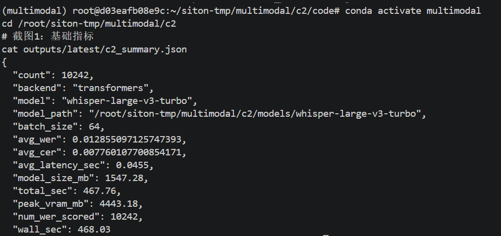
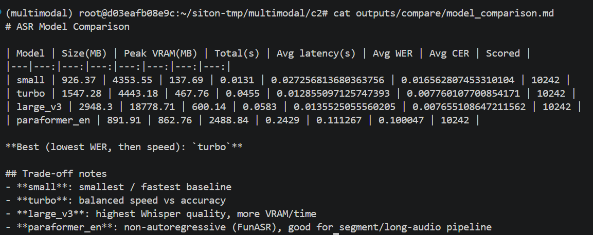
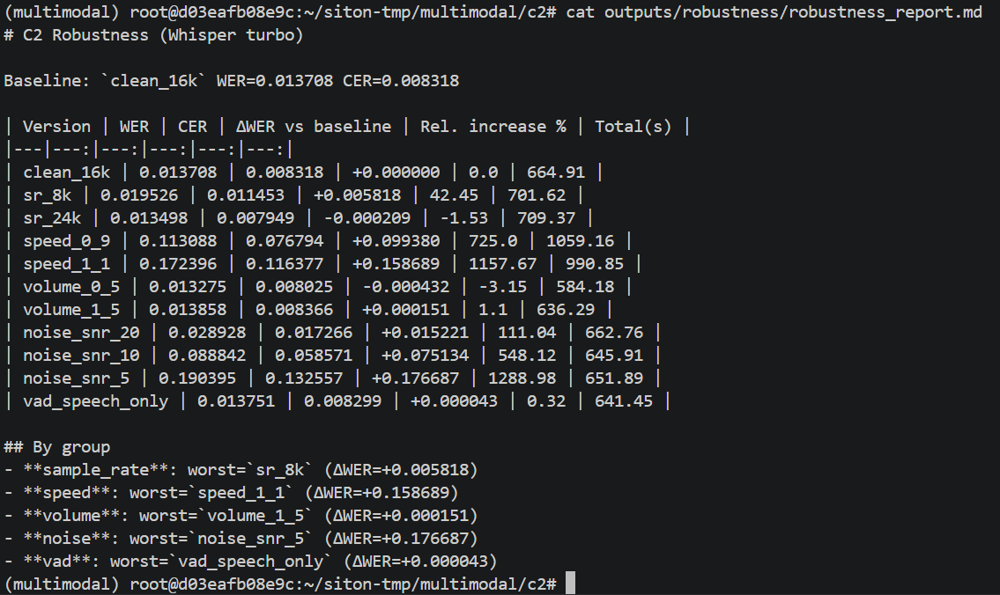
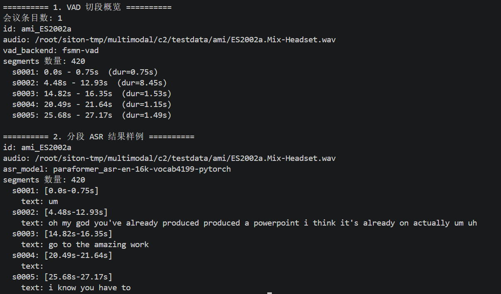

# C2 ASR 语音识别模块 — 个人 README

> **负责人**：蔡润泽（20236547）  
> **所属项目**：多模态语音大模型实训（C1–C5）及组内会议/课堂双语字幕演示系统  
> **负责人分工**：C2 ASR 模型推理；会议系统中的实时流式 ASR  
> **模块路径**：`/root/siton-tmp/multimodal/c2`  
> **Conda 环境**：`multimodal`  
> **更新日期**：2026-07

---

## 1. 模块概述

### 1.1 模块名称

**C2 ASR 语音识别（Automatic Speech Recognition）**

### 1.2 模块说明

本仓库包含两部分：

1. **实训评测主线（本 README 主体）**：将英文语音批量转写为英文文本，向 C3 输出 `asr_predictions.json`，并完成四模型对比、鲁棒性、长音频 VAD+ASR 等进阶实验。  
2. **会议系统实时 ASR（目录 `meeting_asr/`）**：级联路线中的实时流式识别说明与离线批处理脚本；说话人标签、纪要、RAG、翻译等由组内其他成员负责。

实训侧上游接收 C1 处理后的标准音频（或组内统一 `dataset.json`），下游向 C3 输出结构化 JSON。

```text
common_data/dataset.json
        │
        ▼
   C1 音频处理
        │
        ▼
   C2 ASR（本模块）  ──asr_predictions.json──►  C3 级联翻译
        │
        └── asr_error_cases.md ──►  全组错误传播分析
```

**设计目标：**

1. 完成 Whisper 批量 ASR 推理与 WER/CER 自动评测  
2. 对比多种 ASR 模型，为全组选定默认模型（turbo）  
3. 评估 C1 音频增强对 ASR 的影响（鲁棒性实验）  
4. 验证长音频 VAD 切段 + 分段 ASR 的可行性（AMI 会议场景）

### 1.3 完成情况概览

| 类型 | 完成情况 |
|---|---|
| 基础要求 | ✅ 已完成：环境配置、Whisper 批量推理、WER/CER 评测、`asr_predictions.json` 输出 |
| 进阶要求 | ✅ 多模型对比（4 模型）、鲁棒性实验（11 版本）、VAD + 长音频分段 ASR |
| 可独立运行的演示 | ✅ `python c2_asr.py` 单模型批量推理；✅ `run_all_models.py` + `compare_models.py` 四模型对比 |
| 与团队系统集成情况 | ✅ C3 通过固定路径读取 `outputs/latest/asr_predictions.json`；字段 `id` + `prediction_text` 与全组样本 id 对齐 |
| 会议系统实时流式 ASR | ✅ 见 `meeting_asr/`（说话人标注由组长负责，本仓库不展开） |

---

## 2. 环境、模型与数据依赖

### 2.1 运行环境

| 项目 | 要求 |
|---|---|
| Python 版本 | 3.10（conda 环境 `multimodal`） |
| 必要依赖 | PyTorch（CUDA）、transformers、jiwer、librosa、soundfile、funasr（会议线） |
| 是否需要模型 | **需要**（Whisper / Paraformer / FSMN-VAD） |
| 是否需要 GPU | **需要**（批量推理与评测；large_v3 峰值显存约 18 GB） |
| 是否需要外部数据集 | **需要**（组内 `common_data/dataset.json`；鲁棒性用 C1 `advanced_outputs`） |

### 2.2 模型依赖

| 模型 | 来源 | 项目内相对路径 | 用途 |
|---|---|---|---|
| Whisper small | [HuggingFace](https://huggingface.co/openai/whisper-small) | `models/whisper-small` | 速度基线 / 对比实验 |
| Whisper large-v3-turbo | [HuggingFace](https://huggingface.co/openai/whisper-large-v3-turbo) | `models/whisper-large-v3-turbo` | **默认 ASR 主线模型** |
| Whisper large-v3 | [HuggingFace](https://huggingface.co/openai/whisper-large-v3) | `models/whisper-large-v3` | 质量上限对比 |
| Paraformer EN | [ModelScope](https://modelscope.cn/models/iic/speech_paraformer_asr-en-16k-vocab4199-pytorch) | `models/modelscope/iic/speech_paraformer_asr-en-16k-vocab4199-pytorch` | 会议分段 ASR |
| FSMN VAD | [ModelScope](https://modelscope.cn/models/damo/speech_fsmn_vad_zh-cn-16k-common-pytorch) | `models/modelscope/damo/speech_fsmn_vad_zh-cn-16k-common-pytorch` | 长音频 VAD 切段 |

```bash
export TRANSFORMERS_VERBOSITY=error
export MODELSCOPE_CACHE=/root/siton-tmp/multimodal/c2/models/modelscope
# 模型权重需预先下载到 models/ 目录（服务器本地已配置）
```

### 2.3 数据集或样例数据依赖

| 数据或文件 | 来源 | 项目内路径 | 用途 |
|---|---|---|---|
| 全量评测集（10242 条） | 组内 TESS + CREMA-D | `/root/siton-tmp/multimodal/common_data/dataset.json` | 批量 ASR + 四模型对比 |
| C1 鲁棒性 11 版本 | C1 进阶输出 | `/root/siton-tmp/multimodal/c1/advanced_outputs/{TESS,CREMA-D}/<version>/dataset.json` | 鲁棒性实验 |
| AMI 会议音频 | AMI 公开语料 | `testdata/ami/*.Mix-Headset.wav` | 长音频 VAD + 分段 ASR |
| 会议测试清单 | 本模块构造 | `testdata/meeting_dataset.json` | 指定待处理会议 wav |

### 2.4 安装步骤

```bash
# 1. 激活环境
conda activate multimodal

# 2. 进入模块目录
cd /root/siton-tmp/multimodal/c2/code

# 3. 安装依赖（若未安装）
pip install -r /root/siton-tmp/multimodal/c2/requirements.txt

# 4. 验证 GPU
python -c "import torch; print(torch.cuda.is_available())"
```

**最小独立运行依赖**：Python 3.10 + PyTorch(CUDA) + transformers + jiwer + 本地 Whisper 模型 + `dataset.json`。

---

## 3. 文件结构与接口边界

### 3.1 文件结构

```text
c2/
├── README.md                      # 本说明文档
├── requirements.txt               # Python 依赖
├── code/
│   ├── c2_asr.py                  # Whisper 批量推理核心
│   ├── run_all_models.py          # 四模型一键评测
│   ├── compare_models.py          # 对比表 + 发布 latest
│   ├── run_robustness.py          # 11 版本鲁棒性实验
│   ├── analyze_robustness.py      # 鲁棒性汇总报告
│   ├── vad.py                     # FSMN VAD 切段
│   └── paraformer_asr.py          # 会议分段 ASR
├── outputs/
│   ├── latest/                    # C3 正式接口（asr_predictions.json）
│   ├── eval/                      # 四模型全量结果
│   ├── compare/                   # 模型对比表
│   ├── robustness/                # 鲁棒性实验输出
│   └── meeting/                   # 会议 VAD + ASR 结果
├── docs/
│   ├── asr_error_cases.md         # ASR 错误样例分析
│   └── images/                    # README 截图（可选）
├── testdata/
│   ├── meeting_dataset.json
│   └── ami/
├── models/                        # 本地模型权重
└── logs/                          # 运行日志
```

### 3.2 接口边界

| 类型 | 来源 / 去向 | 数据格式 | 说明 |
|---|---|---|---|
| 输入 | C1 / 组内 `common_data/dataset.json` | JSON（`id`, `audio`, `reference_text`） | 批量 ASR 的数据入口 |
| 输入 | C1 `advanced_outputs/.../dataset.json` | JSON | 鲁棒性实验各版本数据 |
| 输出 | **C3 级联翻译** | JSON（`id`, `prediction_text`） | 正式文件：`outputs/latest/asr_predictions.json` |
| 输出 | 全组报告 / 答辩 | Markdown | `outputs/compare/model_comparison.md`、`docs/asr_error_cases.md` |
| 输出 | 本模块评测 | JSON | `c2_summary.json`（WER/CER/耗时/显存） |

---

## 4. 基础要求实现与演示

### 4.1 基础功能说明

对应实训说明文档 **C2 ASR 基础要求**：

1. 加载 Whisper 模型，对英文 wav 做批量语音识别  
2. 与 `reference_text` 对比，计算 **WER / CER**  
3. 将识别结果保存为 **`asr_predictions.json`**，供 C3 读取  

### 4.2 基础功能实现路径

| 文件 / 函数 / 脚本 | 作用 |
|---|---|
| `code/c2_asr.py` → `run_asr()` | 读 JSON、加载 Whisper、批量推理、算 WER/CER、写结果 |
| `jiwer` | WER/CER 计算 |
| `outputs/latest/` | 由 `compare_models.py` 发布，作为 C3 固定入口 |

```text
dataset.json → 读取 audio 路径 → Whisper 批量推理 → prediction_text
            → 对比 reference_text → WER/CER → asr_predictions.json + c2_summary.json
```

关键逻辑（示意）：

```python
# c2_asr.py 核心流程
def run_asr(dataset_path, model, outdir):
    samples = load_json(dataset_path)
    model = load_whisper(model)
    for batch in batches(samples):
        texts = model.transcribe(batch)      # 语音 → 文本
        wer, cer = compute_metrics(texts, refs)
    save_json(outdir / "asr_predictions.json")
    save_json(outdir / "c2_summary.json")
```

### 4.3 基础功能输入格式与样例

| 字段 / 输入文件 | 类型 / 格式 | 是否必需 | 说明 |
|---|---|---|---|
| `id` | string | 是 | 全链路唯一样本 ID |
| `audio` | string（wav 绝对/相对路径） | 是 | 16 kHz 英文 wav |
| `reference_text` | string | 否（评测时需要） | 标准转录，用于 WER/CER |

样例输入：

| 样例文件 | 用途 |
|---|---|
| `/root/siton-tmp/multimodal/common_data/dataset.json` | 全量 10242 条批量 ASR 与评测 |

### 4.4 基础功能演示命令

```bash
conda activate multimodal
cd /root/siton-tmp/multimodal/c2/code

# 使用 turbo 模型跑批量 ASR（具体参数以 c2_asr.py 为准）
python c2_asr.py
```

运行后应观察到：

- 终端输出模型加载成功、批量推理进度  
- 生成 `outputs/.../asr_predictions.json`，每条含 `prediction_text`  
- 生成 `c2_summary.json`，含 `avg_wer`、`avg_cer`  


```bash
cat ../outputs/latest/c2_summary.json
head -n 30 ../outputs/latest/asr_predictions.json
```

### 4.5 基础功能输出格式

| 输出文件 / 返回字段 | 格式 | 说明 |
|---|---|---|
| `asr_predictions.json` | JSON 数组 | 每条：`id`, `prediction_text`, `wer`, `cer`, `status` 等 |
| `c2_summary.json` | JSON | 汇总：`avg_wer`, `avg_cer`, `peak_vram_mb`, `total_sec` |
| `outputs/latest/` | 目录 | C3 正式读取入口（由最优模型结果发布） |

**C3 最小读取字段：**

```json
{
  "id": "cremad_1001_dfa_ang_xx",
  "prediction_text": "Don't forget a jacket."
}
```

### 4.6 基础功能结果截图
```

---

## 5. 进阶要求实现与演示

### 5.1 选择的进阶要求

| 进阶要求 | 是否完成 | 对应文件 / 函数 | 简要说明 |
|---|---|---|---|
| 比较不同 ASR 模型 | ✅ 是 | `run_all_models.py`, `compare_models.py` | 4 模型全量对比，选定 turbo |
| 鲁棒性实验 | ✅ 是 | `run_robustness.py`, `analyze_robustness.py` | C1 的 11 种数据版本 × turbo |
| VAD 切段 + 长音频分段 ASR | ✅ 是 | `vad.py`, `paraformer_asr.py` | AMI 会议音频分段识别 |
| 模型大小 / 速度 / 显存 vs WER 权衡 | ✅ 是 | `compare/model_comparison.md` | 四模型量化对比表 |

### 5.2 进阶功能 1：多模型 ASR 对比

#### 功能说明

在 10242 条全量数据上对比 **small / turbo / large_v3 / paraformer_en**，从 WER、CER、推理速度、显存占用四个维度选型，为全组级联系统确定默认 ASR 模型。

#### 实现路径

| 文件 / 函数 / 脚本 | 作用 |
|---|---|
| `run_all_models.py` | 依次调用 `c2_asr.run_asr()` 跑四个模型 |
| `compare_models.py` | 汇总指标，生成 `model_comparison.md`，复制最优结果到 `outputs/latest/` |

```text
dataset.json → run_all_models.py → eval/{small,turbo,large_v3,paraformer_en}/
            → compare_models.py → compare/model_comparison.md + outputs/latest/
```

#### 演示命令

```bash
cd /root/siton-tmp/multimodal/c2/code
python run_all_models.py
python compare_models.py
cat ../outputs/compare/model_comparison.md
```

#### 输出格式

| 输出文件 | 格式 | 说明 |
|---|---|---|
| `outputs/eval/<model>/asr_predictions.json` | JSON | 各模型全量识别结果 |
| `outputs/compare/model_comparison.md` | Markdown | 四模型对比表 |
| `outputs/latest/meta.json` | JSON | 记录 `best_model: turbo` |

#### 主要结论

| Model | Avg WER | Peak VRAM(MB) | 说明 |
|---|---:|---:|---|
| small | 0.0273 | 4354 | 最快，精度较低 |
| **turbo** | **0.0129** | **4443** | **默认推荐** |
| large_v3 | 0.0136 | 18779 | 精度接近，显存高 |
| paraformer_en | 0.1113 | 863 | 批量 WER 较高，用于分段场景 |



---

### 5.3 进阶功能 2：C1 鲁棒性实验

#### 功能说明

在 C1 生成的 **11 种音频版本**（加噪、变速、降采样、VAD 等）上，用 turbo 重复 ASR，量化前端处理对识别率的影响，为 C1 增强策略提供依据。

#### 实现路径

| 文件 / 函数 / 脚本 | 作用 |
|---|---|
| `run_robustness.py` | 遍历 11 版本 dataset.json，逐版跑 turbo |
| `analyze_robustness.py` | 汇总 WER 变化，生成 `robustness_report.md` |

```text
c1/advanced_outputs/<version>/dataset.json → run_robustness.py → robustness/<version>/
                                          → analyze_robustness.py → robustness_report.md
```

#### 演示命令

```bash
cd /root/siton-tmp/multimodal/c2/code
python run_robustness.py
python analyze_robustness.py
cat ../outputs/robustness/robustness_report.md
```

#### 主要结论

- **最敏感**：语速扰动（speed_0_9 / speed_1_1）、低 SNR 噪声（noise_snr_5）  
- **较不敏感**：音量扰动、VAD 去静音、24 kHz 采样率  
- **8 kHz 降采样** WER 明显上升（约 +42%）  
- **基线** `clean_16k`：WER ≈ 0.0137  



---

### 5.4 进阶功能 3：会议长音频 VAD + 分段 ASR

#### 功能说明

针对 AMI 会议等 **长音频**，先用 FSMN-VAD 切分为语音段，再用 Paraformer 逐段识别，验证「长音频 → 分段 → ASR」流水线，区别于批量 JSON 短句评测。

#### 实现路径

| 文件 / 函数 / 脚本 | 作用 |
|---|---|
| `vad.py` | 对 meeting wav 做 VAD，输出时间段 |
| `paraformer_asr.py` | 按 segment 调用 Paraformer 识别 |

```text
testdata/ami/*.wav → vad.py → vad_segments.json → paraformer_asr.py → asr_segments.json
```

#### 演示命令

```bash
cd /root/siton-tmp/multimodal/c2/code
python vad.py
python paraformer_asr.py
cat ../outputs/meeting/asr_segments.json | head
```

#### 输出格式

| 输出文件 | 格式 | 说明 |
|---|---|---|
| `outputs/meeting/vad_segments.json` | JSON | 各段起止时间 |
| `outputs/meeting/asr_segments.json` | JSON | 各段英文转写 |

**示例**：AMI ES2002a 经 VAD 切分为 420 个语音段。



---

## 6. 与团队系统的集成说明

### 6.1 在级联系统中的位置

```text
C1（──标准音频 / dataset.json──► C2（本模块）──asr_predictions.json──► C3──► C5
```

C4 端到端路线不直接读取 C2 输出，但 C2 的 **`docs/asr_error_cases.md`** 用于解释级联 vs 端到端的错误传播差异。

会议演示产品中，本人负责实时流式 ASR（`meeting_asr/`）；说话人标签与纪要等由组长负责。详见该目录 README。

### 6.2 C3 调用方式

| 项目 | 约定 |
|---|---|
| **正式输入文件** | `/root/siton-tmp/multimodal/c2/outputs/latest/asr_predictions.json` |
| **元信息** | `/root/siton-tmp/multimodal/c2/outputs/latest/meta.json`（`best_model: turbo`） |
| **必需字段** | `id`（与 dataset 对齐）、`prediction_text`（英文 ASR 结果） |
| **C3 用法** | 读取 JSON，按 `id` 匹配样本，将 `prediction_text` 送入 Qwen2.5 翻译 |

### 6.3 与 C1 的协作

- 批量评测：直接读组内 `common_data/dataset.json`（已含 wav 路径）  
- 鲁棒性：读 C1 `advanced_outputs/` 下各版本 `dataset.json`  
- 样本 `id` 全流程保持一致，便于 C3 对齐  

### 6.4 联调注意事项

| 问题 | 解决方案 |
|---|---|
| C3 找不到 ASR 文件 | 使用 **绝对路径** `c2/outputs/latest/asr_predictions.json`，勿用 `code/` 下相对路径 |
| GPU OOM（鲁棒性长跑） | 将 `BATCH_SIZE` 从 64 降至 16/32；`run_robustness.py` 支持 skip 已完成版本 |
| 路径命名不一致（proposal 写 C2_ASR/，实际为 c2/） | 以服务器路径 `/root/siton-tmp/multimodal/c2/` 为准 |

---

## 附录：错误样例与日志

| 文件 | 说明 |
|---|---|
| `docs/asr_error_cases.md` | 5 条高 WER 典型错误（ref vs hyp + 对 C3 影响） |
| `logs/run_all_full_4models.log` | 四模型全量运行日志 |
| `logs/run_robustness.log` | 鲁棒性实验日志 |
| `logs/meeting_asr.log` | 会议 ASR 日志 |

